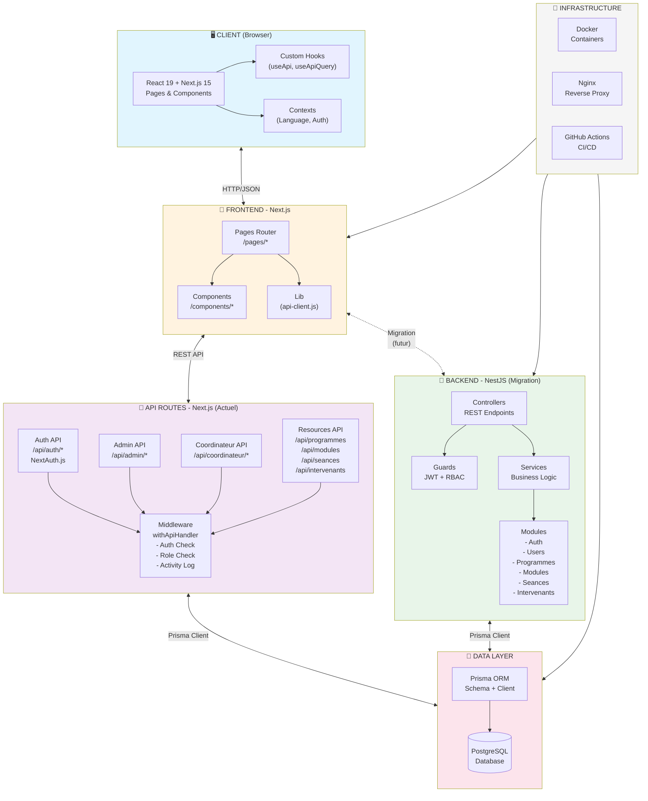
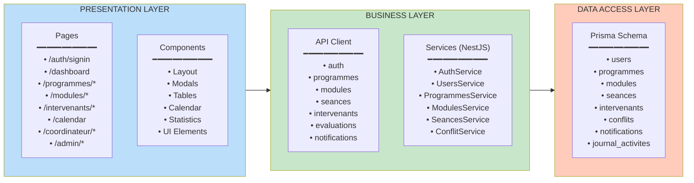
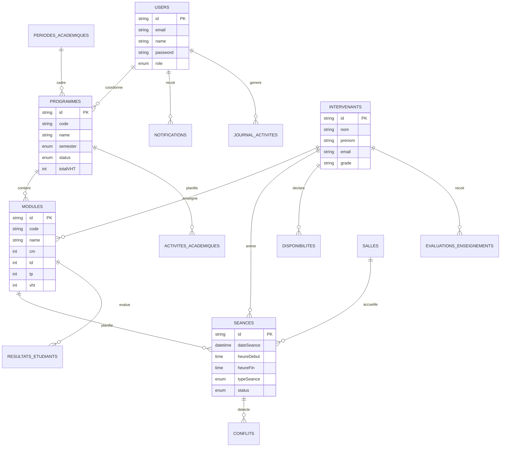
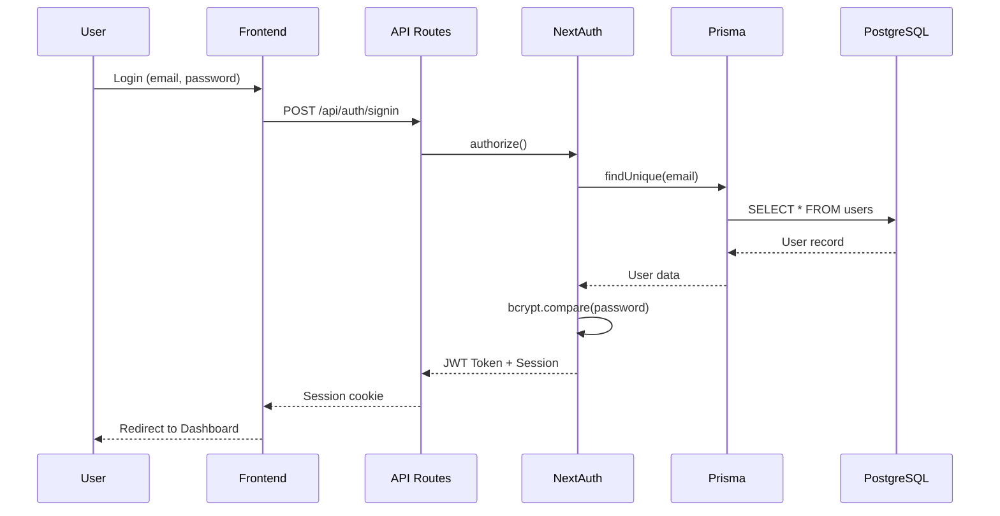
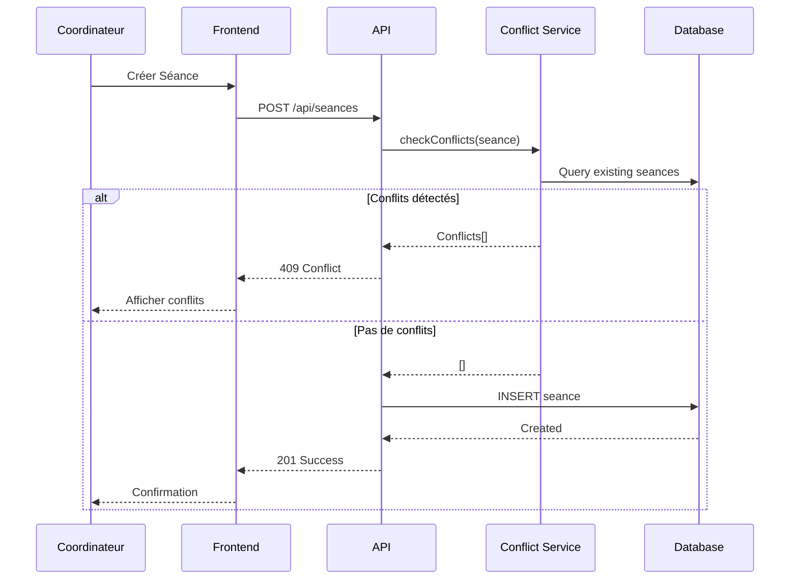
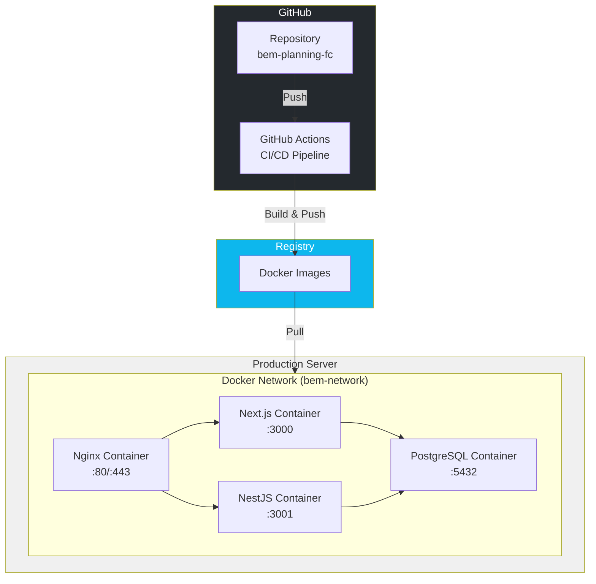
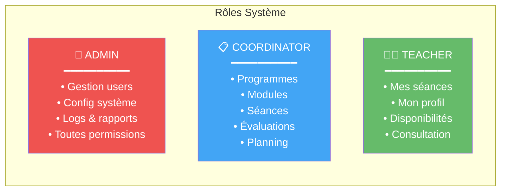

# Architecture Applicative - BEM Planning FC

## Diagramme d'Architecture Globale

## Architecture Détaillée par Couche

## Modèle de Données Simplifié

## Flux d'Authentification

## Flux de Création de Séance avec Détection de Conflits

## Architecture de Déploiement

## Stack Technologique

| Couche | Technologie | Version |
|--------|-------------|---------|
| **Frontend** | Next.js | 15.5.3 |
| | React | 19.1.0 |
| | Tailwind CSS | 4.1.13 |
| | Recharts | 3.5.1 |
| **Backend (Actuel)** | Next.js API Routes | 15.5.3 |
| | NextAuth.js | 4.24.11 |
| **Backend (Migration)** | NestJS | 10.x |
| | Passport | JWT Strategy |
| **ORM** | Prisma | 6.16.1 |
| **Database** | PostgreSQL | 15+ |
| **Infra** | Docker | Multi-stage |
| | GitHub Actions | CI/CD |

## Rôles et Permissions

---

*Diagramme généré pour BEM Planning FC - Architecture Next.js + NestJS*
