# Architecture Applicative - BEM Planning FC

## Diagramme d'Architecture Globale

## Architecture Détaillée par Couche

```mermaid
flowchart LR
    subgraph PRESENTATION["PRESENTATION LAYER"]
        direction TB
        P1["Pages<br/>━━━━━━━━━━━━<br/>• /auth/signin<br/>• /dashboard<br/>• /programmes/*<br/>• /modules/*<br/>• /intervenants/*<br/>• /calendar<br/>• /coordinateur/*<br/>• /admin/*"]
        P2["Components<br/>━━━━━━━━━━━━<br/>• Layout<br/>• Modals<br/>• Tables<br/>• Calendar<br/>• Statistics<br/>• UI Elements"]
    end

    subgraph BUSINESS["BUSINESS LAYER"]
        direction TB
        B1["API Client<br/>━━━━━━━━━━━━<br/>• auth<br/>• programmes<br/>• modules<br/>• seances<br/>• intervenants<br/>• evaluations<br/>• notifications"]
        B2["Services (NestJS)<br/>━━━━━━━━━━━━<br/>• AuthService<br/>• UsersService<br/>• ProgrammesService<br/>• ModulesService<br/>• SeancesService<br/>• ConflitService"]
    end

    subgraph DATA_ACCESS["DATA ACCESS LAYER"]
        direction TB
        D1["Prisma Schema<br/>━━━━━━━━━━━━<br/>• users<br/>• programmes<br/>• modules<br/>• seances<br/>• intervenants<br/>• conflits<br/>• notifications<br/>• journal_activites"]
    end

    PRESENTATION --> BUSINESS
    BUSINESS --> DATA_ACCESS

    style PRESENTATION fill:#bbdefb
    style BUSINESS fill:#c8e6c9
    style DATA_ACCESS fill:#ffccbc
```

## Modèle de Données Simplifié

## Flux d'Authentification

## Flux de Création de Séance avec Détection de Conflits

```mermaid
sequenceDiagram
    participant C as Coordinateur
    participant F as Frontend
    participant A as API
    participant CS as Conflict Service
    participant DB as Database

    C->>F: Créer Séance
    F->>A: POST /api/seances
    A->>CS: checkConflicts(seance)
    CS->>DB: Query existing seances

    alt Conflits détectés
        CS-->>A: Conflicts[]
        A-->>F: 409 Conflict
        F-->>C: Afficher conflits
    else Pas de conflits
        CS-->>A: []
        A->>DB: INSERT seance
        DB-->>A: Created
        A-->>F: 201 Success
        F-->>C: Confirmation
    end
```

## Architecture de Déploiement

## Stack Technologique

| Couche | Technologie | Version |
|--------|-------------|---------|
| **Frontend** | Next.js | 15.5.3 |
| | React | 19.1.0 |
| | Tailwind CSS | 4.1.13 |
| | Recharts | 3.5.1 |
| **Backend (Actuel)** | Next.js API Routes | 15.5.3 |
| | NextAuth.js | 4.24.11 |
| **Backend (Migration)** | NestJS | 10.x |
| | Passport | JWT Strategy |
| **ORM** | Prisma | 6.16.1 |
| **Database** | PostgreSQL | 15+ |
| **Infra** | Docker | Multi-stage |
| | GitHub Actions | CI/CD |

## Rôles et Permissions

```mermaid
flowchart LR
    subgraph ROLES["Rôles Système"]
        ADMIN["🔑 ADMIN<br/>━━━━━━━━━━<br/>• Gestion users<br/>• Config système<br/>• Logs & rapports<br/>• Toutes permissions"]

        COORD["📋 COORDINATOR<br/>━━━━━━━━━━<br/>• Programmes<br/>• Modules<br/>• Séances<br/>• Évaluations<br/>• Planning"]

        TEACHER["👨‍🏫 TEACHER<br/>━━━━━━━━━━<br/>• Mes séances<br/>• Mon profil<br/>• Disponibilités<br/>• Consultation"]
    end

    style ADMIN fill:#ef5350,color:#fff
    style COORD fill:#42a5f5,color:#fff
    style TEACHER fill:#66bb6a,color:#fff
```

---

*Diagramme généré pour BEM Planning FC - Architecture Next.js + NestJS*
