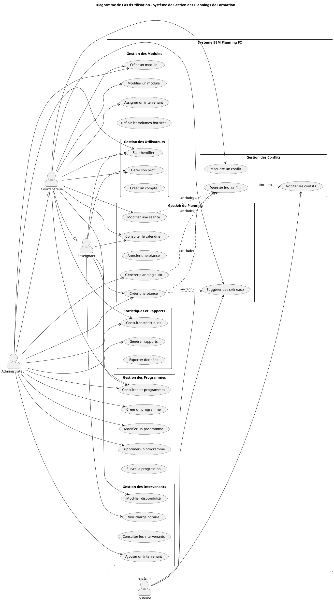
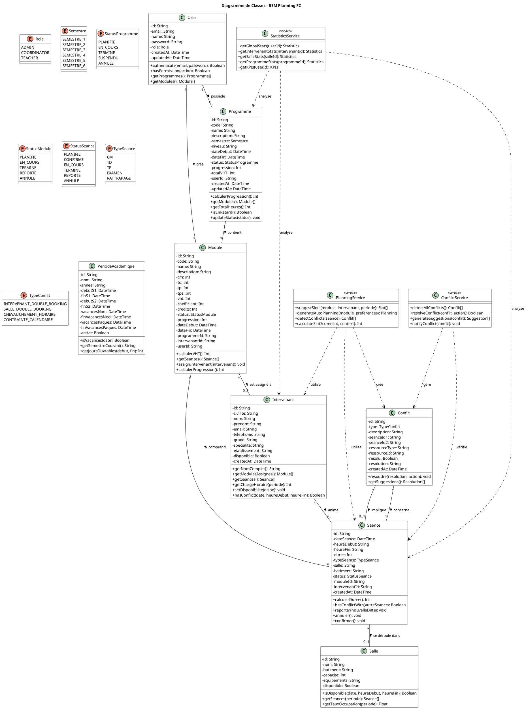
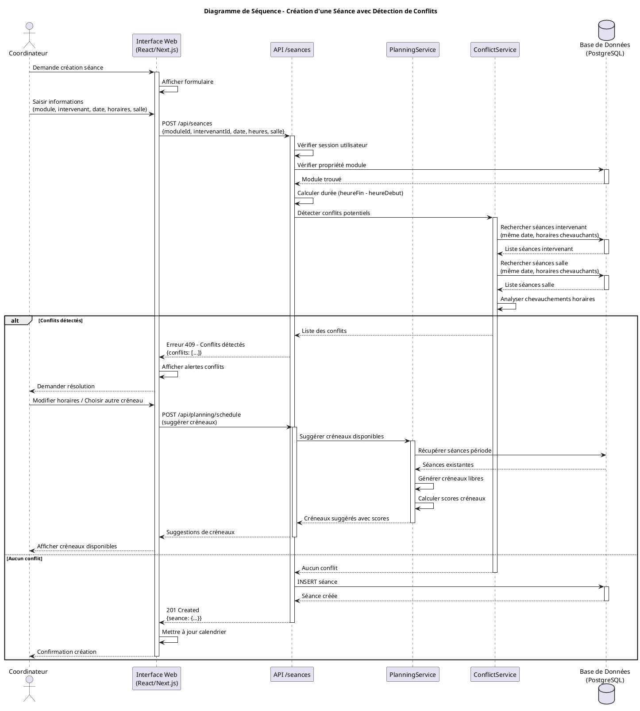
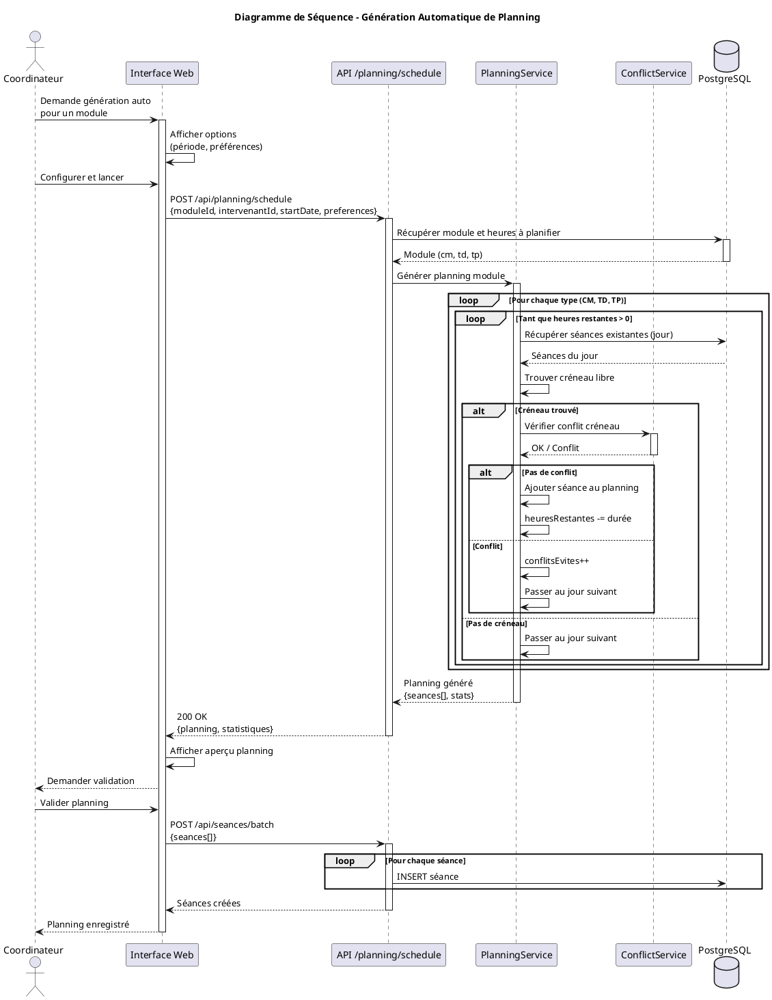
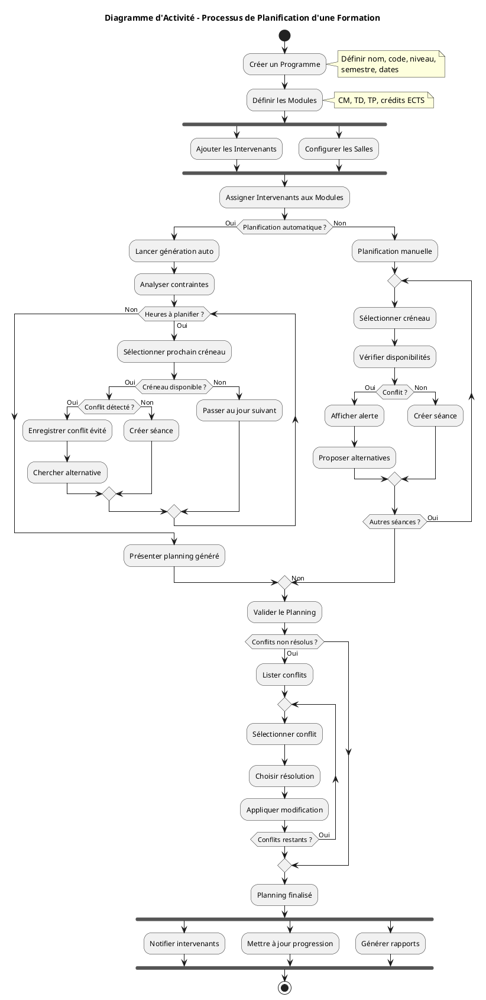
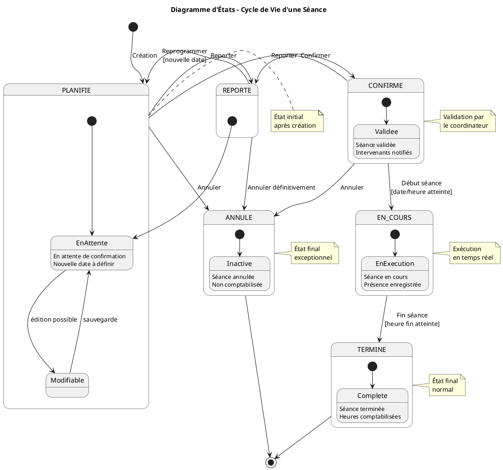
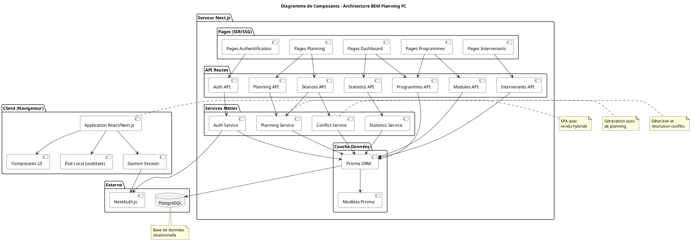

# Diagrammes UML - BEM Planning FC

## 1. Diagramme de Cas d'Utilisation



---

## 2. Diagramme de Classes



---

## 3. Diagramme de Séquence - Création d'une Séance avec Détection de Conflits



---

## 4. Diagramme de Séquence - Génération Automatique de Planning



---

## 5. Diagramme d'Activité - Processus de Planification



---

## 6. Diagramme d'États - Cycle de Vie d'une Séance



---

## 7. Diagramme de Composants - Architecture Technique



---

## Instructions pour Générer les Images

### Option 1 : PlantUML en ligne
1. Aller sur https://www.plantuml.com/plantuml/uml
2. Copier le code entre `@startuml` et `@enduml`
3. Télécharger l'image générée

### Option 2 : Extension VS Code
1. Installer l'extension "PlantUML"
2. Ouvrir ce fichier
3. `Alt+D` pour prévisualiser
4. Exporter en PNG/SVG

### Option 3 : Ligne de commande
```bash
# Installer PlantUML
sudo apt install plantuml

# Générer les images
plantuml 01-diagrammes-uml.md -o ./images
```
